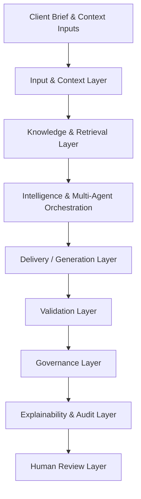
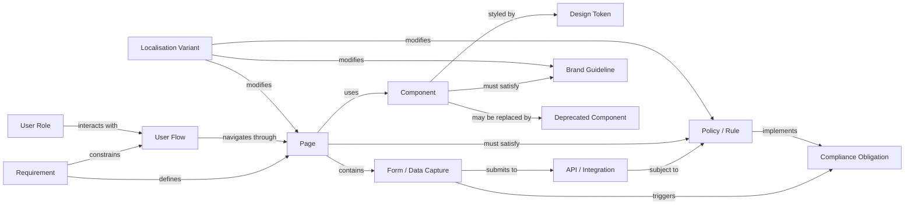
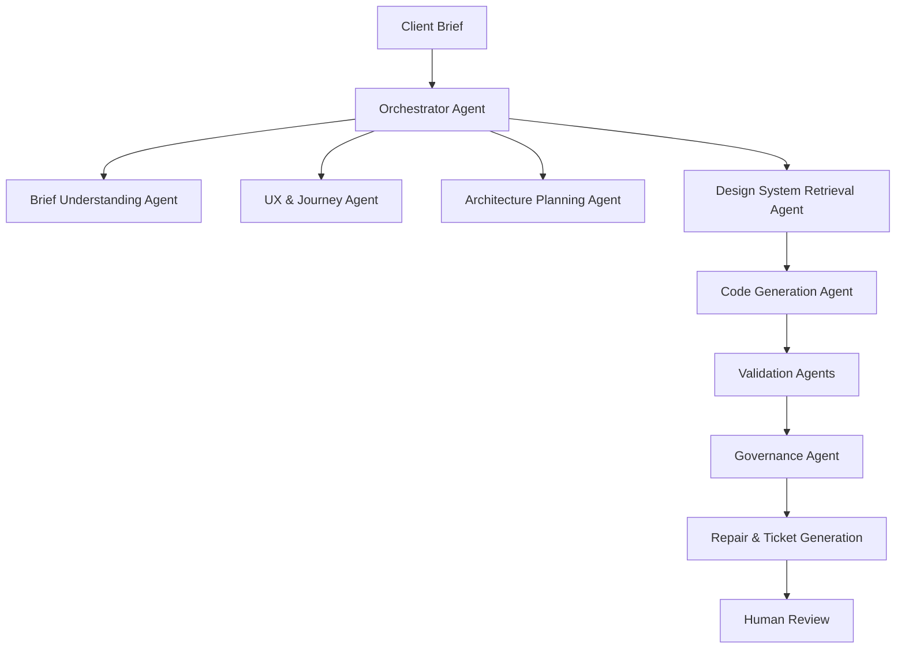
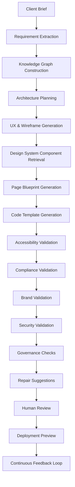

# Blueprint AI

<p align="center">
AI-assisted orchestration platform for accelerating the web design lifecycle while ensuring  
<b>brand consistency, accessibility, compliance, and design-system governance.</b>
</p>

---

# Overview

**Blueprint AI** is a research prototype that explores how artificial intelligence can coordinate the **entire web design and delivery lifecycle**, rather than simply generating UI or code from prompts.

Most AI web tools today operate on a narrow pipeline:

```
Prompt → UI → Code
```

However, real web development requires coordination across many stages including:

- requirement interpretation  
- architecture planning  
- UX design  
- design-system integration  
- accessibility validation  
- compliance checks  
- security analysis  
- deployment workflows  
- long-term governance  

Blueprint AI proposes an **AI-assisted orchestration platform** where multiple specialised AI agents collaborate to transform a **client brief into a deployable web experience**, while ensuring that generated outputs remain **compliant, explainable, and aligned with design systems**.

---

# Key Capabilities

The system demonstrates how AI can assist with:

- interpreting client briefs  
- generating structured requirement specifications  
- recommending design-system components  
- generating page blueprints and code templates  
- validating accessibility and regulatory compliance  
- detecting design-system drift  
- generating explainable reports  
- recommending remediation actions  
- supporting human-in-the-loop decision making  

---

# System Architecture

Blueprint AI follows a **layered architecture** designed to separate generation, validation, governance, and human oversight.

This separation ensures that:

- AI **generates artefacts**  
- independent systems **validate them**  
- governance modules **monitor consistency**  
- humans **approve critical decisions**

---

# Architecture Diagram



---

# Architecture Layers

## 1. Input and Context Layer

The **Input Layer** collects all information required to initiate the web delivery workflow.

Typical inputs include:

- client briefs  
- stakeholder notes  
- brand guidelines  
- design-system documentation  
- accessibility standards  
- compliance policies  
- architecture templates  
- localisation rules  
- previous project artefacts  

### Responsibilities

- document ingestion  
- text parsing  
- requirement extraction  
- context structuring  

---

## 2. Knowledge and Retrieval Layer

This layer provides contextual knowledge required for grounded AI reasoning.

### Vector Database

Stores embeddings of documents including:

- design-system documentation  
- brand guidelines  
- accessibility policies  
- compliance rules  
- engineering standards  

Supports **Retrieval Augmented Generation (RAG)**.

---

### Knowledge Graph

Represents relationships between:

- requirements  
- pages  
- components  
- APIs  
- policies  
- localisation variants  

The graph enables traceability across system decisions.

---

### Policy and Rule Engine

Certain rules must be enforced deterministically rather than probabilistically.

Examples include:

- approved component variants  
- consent requirements for personal data  
- typography and colour tokens  
- regional regulatory rules  

---

# Knowledge Graph Schema

The knowledge graph acts as the system’s **structured reasoning backbone**. It links project requirements to pages, components, APIs, compliance obligations, brand rules, and localisation variants.

## What the knowledge graph captures

- which **requirements** lead to which **pages**  
- which **pages** use which **components**  
- which **components** depend on which **design tokens**  
- which **forms or APIs** introduce compliance obligations  
- which **policies** apply to a page or component  
- which **market variants** affect layout or content  
- which **deprecated components** affect generated blueprints  

---

## Knowledge Graph Schema Diagram



---

# Multi-Agent System

The intelligence layer contains a **multi-agent architecture** where specialised agents collaborate under the control of an **Orchestrator Agent**.

## Multi-Agent Interaction Diagram



---

# Delivery Layer

The Delivery Layer produces **intermediate artefacts** required throughout the development lifecycle.

Examples include:

- requirement specifications  
- sitemaps  
- wireframes  
- page blueprints  
- component compositions  
- code templates  
- deployment manifests  

Generating structured artefacts rather than full websites improves traceability.

---

# Validation Layer

All generated artefacts pass through an independent validation pipeline.

### Accessibility Validation

Ensures compliance with WCAG guidelines by checking:

- colour contrast  
- semantic HTML  
- keyboard accessibility  
- alternative text  
- form labels  

---

### Compliance Validation

Evaluates regulatory requirements such as:

- GDPR consent flows  
- privacy policy links  
- cookie banners  
- personal data handling  

---

### Brand Consistency Validation

Ensures alignment with brand guidelines:

- approved colour tokens  
- typography rules  
- spacing tokens  
- component usage  

---

### Security Validation

Detects vulnerabilities including:

- injection risks  
- insecure API calls  
- exposed secrets  
- weak input validation  

---

### Performance & SEO Validation

Checks:

- performance indicators  
- metadata structure  
- search engine optimisation practices  

---

# Governance Layer

The Governance Layer ensures long-term alignment with the official design system.

Governance checks include:

- deprecated component detection  
- design token drift detection  
- off-system UI patterns  
- duplicated custom components  
- cross-project consistency monitoring  

When inconsistencies are detected, the system recommends upgrades or replacements.

---

# Lifecycle Workflow

The orchestrator coordinates the entire pipeline from brief to deployment.

## Lifecycle Pipeline Diagram



---

# Explainability Layer

The Explainability Layer provides transparency into system behaviour.

## Getting started (Phase 1)

Quick steps to run the Phase 1 prototype locally:

1. Create a Python environment (recommended):

```bash
python -m venv .venv
source .venv/bin/activate
pip install -r requirements.txt
```

2. Copy `.env.example` to `.env` and add your LLM keys if available.

3. Run the Streamlit app:

```bash
streamlit run app.py
```

Phase 1 includes the core data models, local knowledge JSON files, and a Streamlit scaffold. Subsequent phases will add the multi-agent orchestration, validators, and knowledge-graph reasoning.

The system can explain:

- why a component was selected  
- which rule triggered validation failures  
- which knowledge sources were retrieved  
- recommended remediation steps  

Explainability improves trust in AI-assisted workflows.

---

# Human Review Layer

Human oversight is integrated throughout the system.

### Human checkpoints

1. requirement confirmation  
2. architecture approval  
3. UX review  
4. validation review  
5. governance decisions  
6. deployment approval  

Blueprint AI therefore operates as **AI-assisted orchestration rather than full automation**.

---

# Prototype Scope

This repository contains a prototype demonstrating three core capabilities.

### A — Brief to Blueprint Generation

AI interprets client briefs and recommends design-system components.

Outputs include:

- page blueprints  
- component compositions  
- code templates  

---

### B — Automated Validation

Generated artefacts are validated against:

- accessibility standards  
- brand guidelines  
- regulatory compliance  

---

### C — Design System Governance

The system detects:

- deprecated components  
- design token drift  
- off-system patterns  

---

# Prototype Interface

The prototype interface is implemented using **Streamlit**.

Streamlit enables rapid development of an interactive research demo that allows users to:

- submit project briefs  
- inspect structured requirements  
- view generated page blueprints  
- analyse validation reports  
- explore governance findings  
- inspect explainability outputs  

This lightweight interface ensures development effort focuses on **AI orchestration and validation logic rather than frontend engineering**.

---

# Technology Stack

### Frontend

- Streamlit  

### Backend

- Python  
- FastAPI (optional API services)  

### Agent Framework

- LangGraph or CrewAI  

### AI Models

- OpenAI API  
- structured prompting  
- tool calling  

### Retrieval Layer

- pgvector / Chroma / Pinecone  

### Knowledge Graph

- Neo4j or PostgreSQL graph model  

### Validation Tools

- axe-core  
- Lighthouse  
- ESLint  
- Semgrep  
- custom rule engine  

---

# Repository Structure

```
blueprint-ai/

agents/
    orchestrator.py
    brief_agent.py
    ux_agent.py
    retrieval_agent.py
    code_agent.py

validation/
    accessibility_validator.py
    compliance_validator.py
    brand_validator.py
    security_validator.py

governance/
    drift_detector.py
    component_registry.py

knowledge/
    rag_pipeline.py
    knowledge_graph.py
    policy_engine.py

ui/
    streamlit_app.py

docs/
    architecture.md
    workflow.md
```

---

# Benefits

### Accelerated Web Delivery

AI assists with requirement analysis, component retrieval, and validation.

### Design System Governance

Prevents UI drift across projects.

### Regulatory Compliance

Automated checks reduce compliance risks.

### Explainable AI

Transparent reasoning improves trust.

### Scalable Architecture

Modular design allows future extensions.

---

# Future Work

Potential future extensions include:

- automated localisation workflows  
- integration with design tools such as Figma  
- reinforcement learning from human feedback  
- automated A/B testing optimisation  
- enterprise design-system management tools  

---

# License

This repository is intended for **academic and research purposes**.

---
